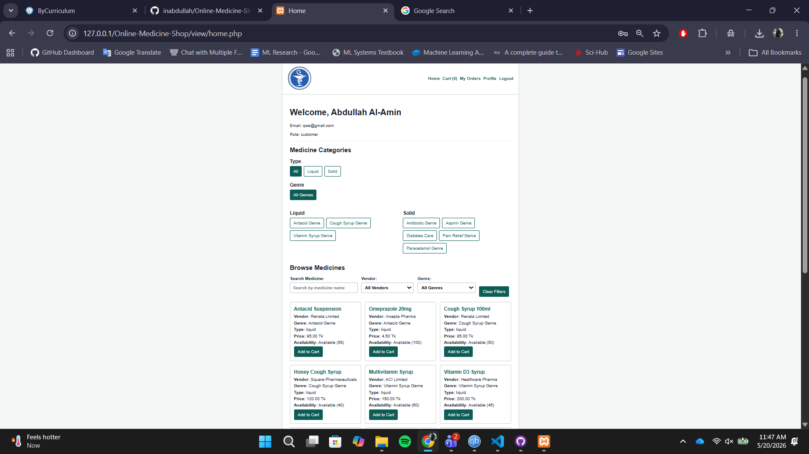
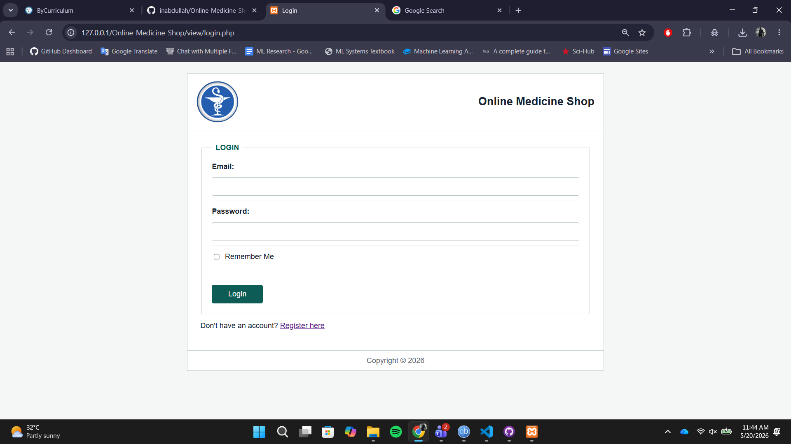
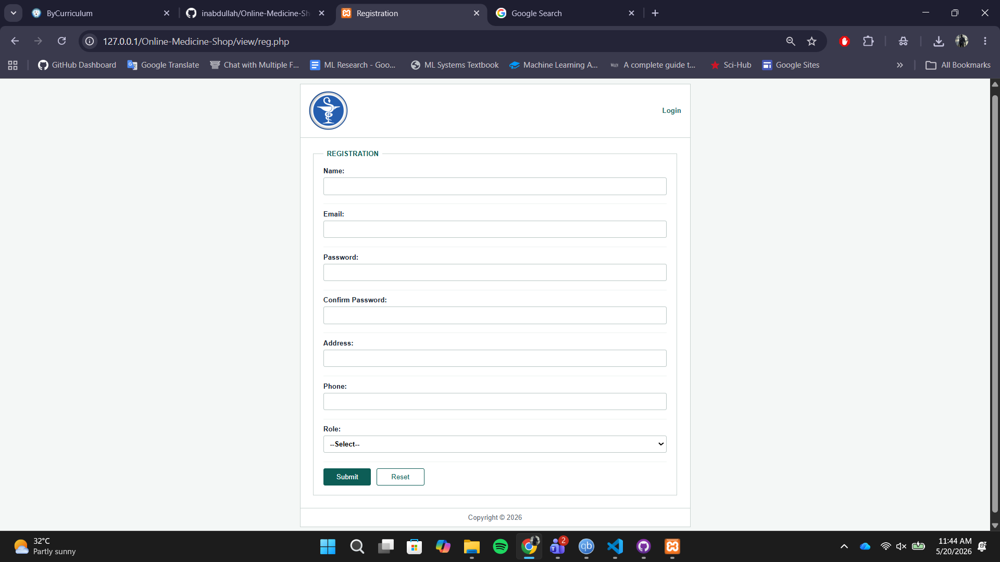
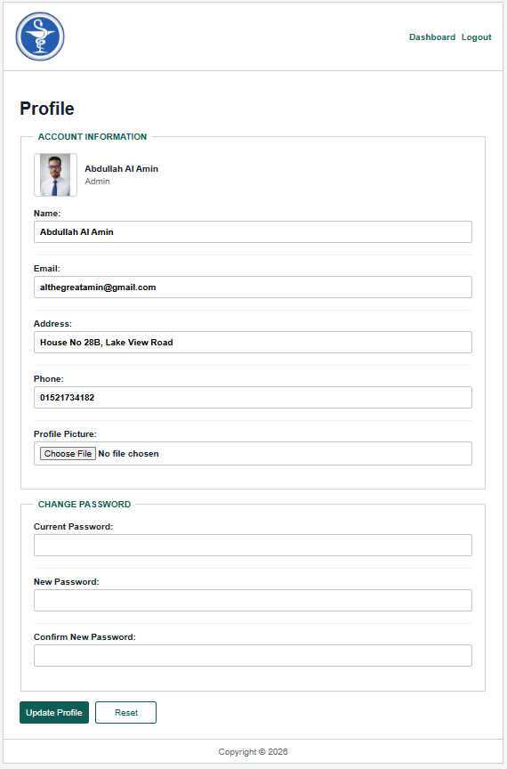
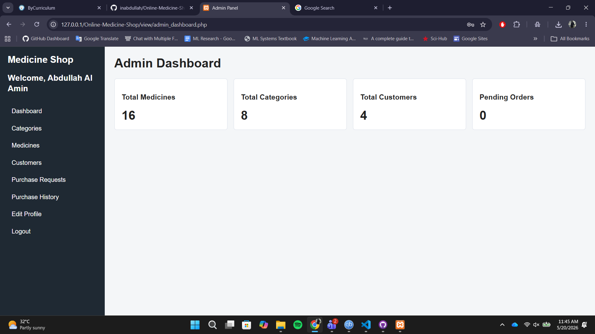
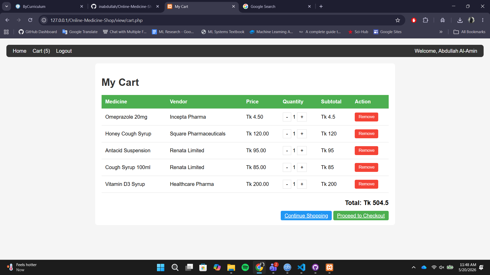
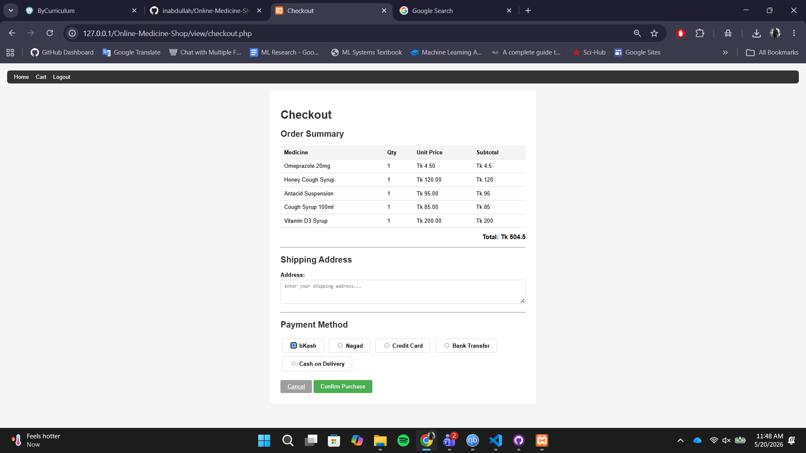

# Online Medicine Shop

A full-stack e-commerce web application for purchasing medicines online. The platform allows customers to browse medicines, manage their cart, place orders, and complete checkout, while administrators can manage medicines, categories, customers, and purchase requests.

This project was developed as part of the **Web Technologies (CSE 4101 / CSC 3215)** course at **American International University-Bangladesh (AIUB)**.

---

## Project Overview

Online Medicine Shop is a secure, responsive, and MVC-based web application designed to simplify the process of buying medicines online. The system supports two user roles:

### Admin
- Manage medicine categories
- Perform full CRUD operations on medicines
- View and delete customers
- View all purchase requests
- Accept or reject orders
- View complete purchase history

### Customer
- Register and log in
- Update profile information
- Browse medicines by category
- Search and filter medicines
- Add medicines to cart
- Manage cart quantities
- Checkout with shipping address
- View invoice
- Select payment method
- Receive order confirmation

---

## Team Members

| Student ID | Name |
|----------|----------|
| 23-50731-1 | Faysal Ahmed |

---

## Key Features

### User Authentication
- Registration for Admin and Customer roles
- Secure login with password hashing
- Remember Me functionality
- Session-based authentication
- Role-based access control
- Logout with secure cookie removal

### Profile Management
- Update personal details
- Upload profile pictures
- Change password with current password verification

### Medicine Browsing
- Browse medicines by category
- Liquid and Solid segmentation
- Detailed medicine cards with price and stock

### Search and Filtering
- AJAX-based live search
- Filter by medicine name, vendor, category, and type

### Shopping Cart
- Add medicines to cart
- Increase/decrease quantity
- Remove items dynamically

### Checkout and Payment
- Shipping address confirmation
- Invoice generation
- Payment method selection
- Order creation and confirmation

### Admin Panel
- Dashboard statistics
- Category CRUD
- Medicine CRUD
- Customer management
- Purchase request review
- Accept/reject orders

### Security
- Prepared statements
- CSRF protection
- XSS prevention
- Secure sessions
- File upload validation

---

## Technology Stack

| Layer | Technology |
|------|------|
| Frontend | HTML5, CSS3, JavaScript |
| Backend | PHP |
| Database | MySQL |
| AJAX | Fetch API |
| Data Format | JSON |
| Architecture | MVC |
| Server | Apache (XAMPP) |
| Version Control | Git & GitHub |

---

## Project Structure

```text
Online-Medicine-Shop/
├── api/
│   ├── medicines/
│   ├── cart/
│   └── orders/
├── asset/
│   ├── css/
│   ├── js/
│   └── images/
├── controller/
│   ├── auth/
│   ├── profile/
│   ├── admin/
│   └── customer/
├── model/
│   ├── db.php
│   ├── userModel.php
│   ├── medicineModel.php
│   ├── cartModel.php
│   └── orderModel.php
├── public/
│   └── uploads/
│       ├── profile_pictures/
│       └── medicines/
├── view/
│   ├── auth/
│   ├── admin/
│   ├── customer/
│   └── shared/
└── index.php
```

---

## Database Schema

### Main Tables
- `users`
- `categories`
- `medicines`
- `cart`
- `orders`
- `order_items`
- `payments`
- `remember_tokens`

---

## Installation and Setup

### 1. Clone the Repository

```bash
git clone https://github.com/Faysal105/Online-Medicine-Shop.git
cd Online-Medicine-Shop
```

### 2. Move Project to XAMPP

Copy the project folder to:

```text
C:\xampp\htdocs\
```

### 3. Create Database

Create a database named:

```sql
online_medicine_shop
```

### 4. Import SQL File

Import the provided SQL schema into MySQL.

### 5. Configure Database Connection

Update `model/db.php`:

```php
$host = "localhost";
$dbname = "online_medicine_shop";
$username = "root";
$password = "";
```

### 6. Start Apache and MySQL

Start both services using XAMPP Control Panel.

### 7. Run the Application

Open:

```text
http://localhost/Online-Medicine-Shop/
```

---

## API Endpoints

### Search Medicines
```http
GET /api/medicines/search?q=&vendor=&genre=&type=
```

### Add to Cart
```http
POST /api/cart/add
```

### Update Cart
```http
POST /api/cart/update
```

### Remove Cart Item
```http
DELETE /api/cart/remove
```

### Update Order Status
```http
POST /api/orders/update-status
```

---

## Security Measures

- Password hashing using `password_hash()`
- Password verification using `password_verify()`
- Prepared statements for all SQL queries
- CSRF token validation
- Session regeneration after login
- Secure Remember Me cookies
- Output escaping with `htmlspecialchars()`
- Server-side file upload validation

---

## Screenshots

### Home Page


### Login Page


### Registration Page


### Profile Page


### Admin Dashboard


### Shopping Cart


### Checkout Page


---

## Learning Outcomes

This project provided practical experience in:

- PHP MVC architecture
- Authentication and authorization
- AJAX and JSON APIs
- Session and cookie management
- File upload handling
- MySQL database design
- Secure web development
- Team collaboration with Git and GitHub

---

## Future Improvements

- Email verification
- Forgot password functionality
- Product reviews and ratings
- Prescription upload support
- Online payment gateway integration
- Advanced reporting and analytics
- Progressive Web App (PWA) support

---

## GitHub Repository

https://github.com/Faysal105/Online-Medicine-Shop

---

## Course Information

- **Course:** Web Technologies (CSE 4101 / CSC 3215)
- **Project Title:** Online Medicine Shop
- **Section:** Q
- **Semester:** Spring 2025–2026

---
## Logo Attribution

The project logo used in this repository was obtained from PNGWing.

**IEEE Reference Format:**

[1] PNGWing, "Medicine Logo PNG Transparent Image," PNGWing. [Online]. Available: https://www.pngwing.com/en/free-png-taeiu. [Accessed: 20-May-2026].

---

## References

[1] PNGWing, "Medicine Logo PNG Transparent Image," PNGWing. [Online]. Available: https://www.pngwing.com/en/free-png-taeiu. [Accessed: 20-May-2026].

## License

This project was developed for academic purposes only.